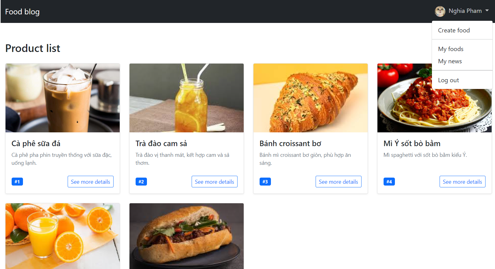
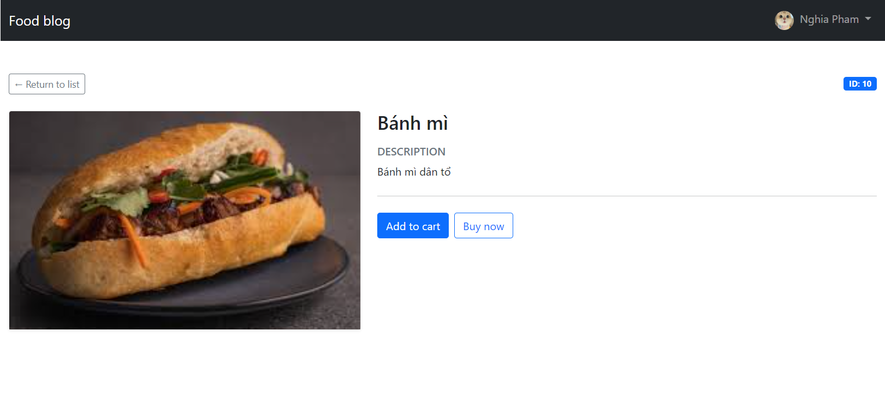
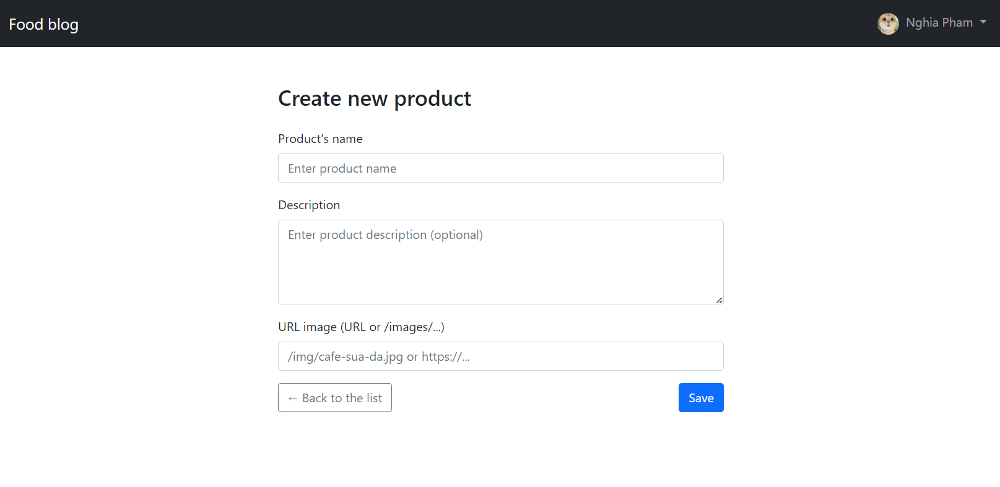
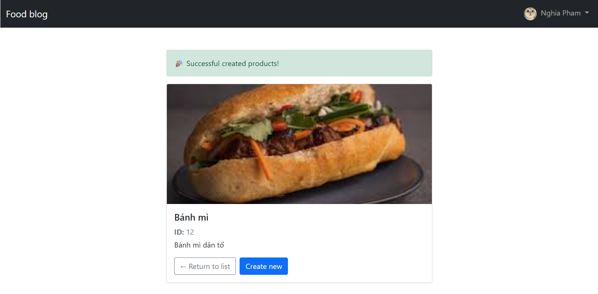
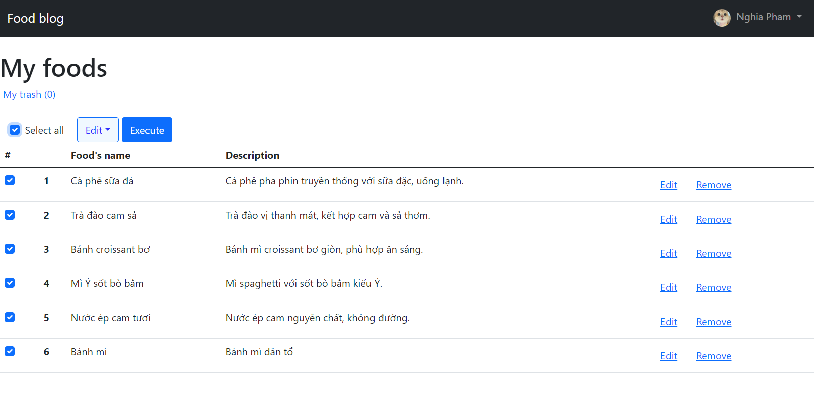
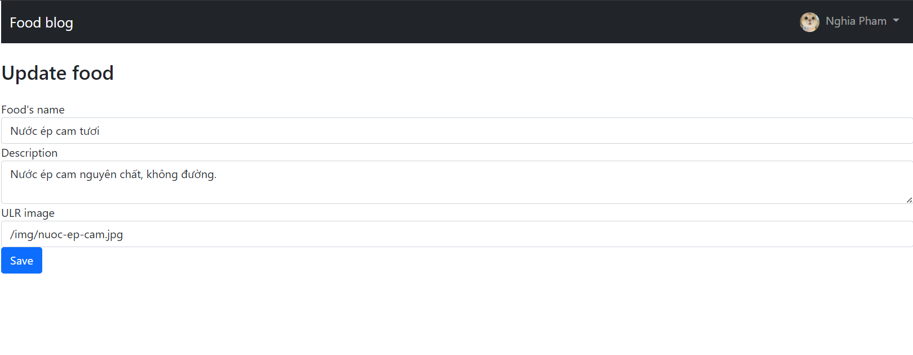
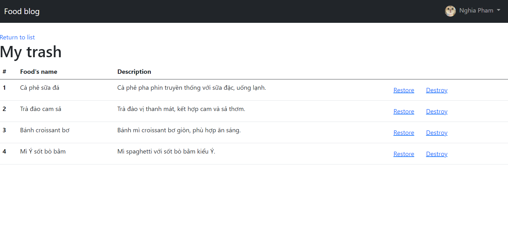

# 🍜 Simple Food Blog – MVC Node.js Practice Project 

This project is a **simple food blog** designed to:
- Help me get familiar with the **MVC (Model – View – Controller)** architectural pattern  
- Practice **CRUD operations** on a *Food* entity  
- Understand how data flows through Model → Controller → View  

## 🚀 Technologies Used 
- Node.js / Express  
- Template engine (Handlebars)  
- HTTP request method supporter (Method-override)
- HTTP request logger middleware (Morgan)
- Auto restart server (Nodemon)
- Code formatter (Prettier)
- Database: PostgreSQL (pg)
- MVC pattern  

## 🧩 Main Features

### View all food items

### View details of a single food item  

### Add new food items  
  - Name  
  - Description  
  - Image URL  

### View all onwer's items 
  - Edit item
  - Remove item (soft delete)

### View in trash's items 
  - Restore removed item
  - Destroy item (permanently delete)

